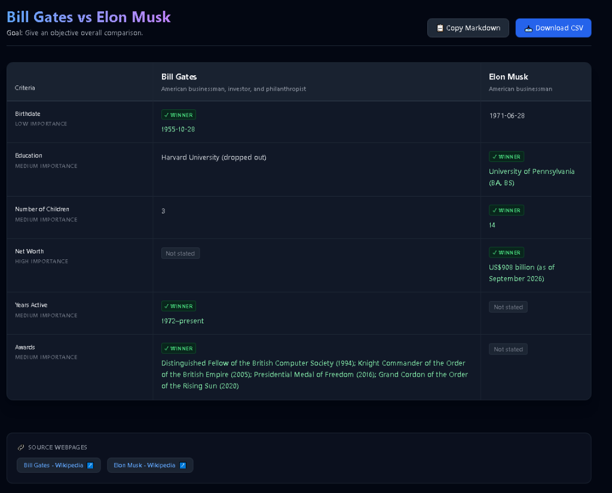

# Compare Anything

> Stop switching between tabs. Compare them.



[](https://github.com/ramim452996/Extension)
[](https://developer.chrome.com/docs/extensions/mv3/intro/)
[](https://groq.com)
[](https://www.typescriptlang.org/)
[](LICENSE)

---

## 📖 Table of Contents
1. [What It Does](#-what-it-does)
2. [Architecture & Technical Flow](#-architecture--technical-flow)
3. [Repository Structure](#-repository-structure)
4. [Installation & Setup](#-installation--setup)
5. [Local Development](#-local-development)
6. [Environment Variables](#-environment-variables)
7. [Privacy Approach](#-privacy-approach)
8. [Contributors](#-contributors)
9. [License](#-license)

---

## ⚡ What It Does

**Compare Anything** delivers 5-second product value: eliminate endless tab-switching by instantly generating a structured, side-by-side comparative breakdown across 2 to 4 open webpages.

- **Multi-Tab Comparison:** Works seamlessly with 2–4 open tabs across any domain—consumer hardware, SaaS subscription plans, job postings, course curricula, and academic programs.
- **Custom Goals & Priorities:** Allows users to specify target constraints (e.g., *"Best for programming under Tk 80,000"* or *"Remote work with equity"*), factoring them directly into the winner analysis.
- **Strictly Evidence-Based:** Extracts facts directly from source HTML without guessing or hallucinating missing specs; any unstated detail is strictly labeled `"Not stated"`.
- **Structured Decision Outputs:** Provides an analytical, Google Flights–style matrix with Best Overall recommendation cards, tailored trade-offs, and source links.
- **Instant Export Actions:** One-click Markdown copy for Notion/GitHub and RFC-4180 compliant CSV download for Google Sheets and Excel.

---

## 🏗️ Architecture & Technical Flow

Compare Anything follows a decoupled, security-first two-tier architecture:

```text
[Browser Tabs (2-4 Pages)] ──> [Chrome Extension (React + Vite)] ──(HTTPS)──> [ASP.NET Core Web API (IAIProvider)] ──> [Groq (openai/gpt-oss-20b)]
```

### Core Tiers:
1. **Frontend (Chrome Extension):**
   - Built on **Manifest V3**, **TypeScript**, **React**, and **Vite**.
   - Operates with minimal permissions (`activeTab`, `scripting`, `storage`).
   - Content scripts extract visible text only when explicitly invoked by the user.
   - Maintains comparison workspace state client-side in `chrome.storage.local`.
2. **Backend (Web API Proxy):**
   - **ASP.NET Core 10 Web API** acts as a strict security boundary.
   - Encapsulates inference behind the `IAIProvider` interface (supporting Groq and OpenRouter).
   - Zero AI provider keys, tokens, or backend credentials are ever included in client bundles.
   - Enforces rate limiting, input character truncation, URL sanitization, and structured JSON output schemas.

---

## 📁 Repository Structure

```text
.
├── SPEC.md                                   # Comprehensive engineering & UI specification
├── README.md                                 # Project documentation (this file)
├── LICENSE                                   # MIT License
├── .gitignore                                # Strict secrets and build artifact exclusions
├── docs/                                     # Public GitHub Pages site & submission guides
│   ├── index.html                            # Lightweight, responsive landing page (Section 43)
│   ├── privacy-policy.html                   # Chrome Web Store compliant privacy policy
│   ├── support.html                          # User support, contact, and FAQ guide
│   ├── chrome-store-submission.md            # Web Store metadata and screenshot checklist
│   └── screenshot.png                        # Primary UI preview asset (1280x800)
├── extension/                                # Frontend Manifest V3 extension
│   ├── .env.example                          # Extension environment variables template
│   ├── manifest.json                         # Chrome MV3 manifest
│   ├── src/
│   │   ├── popup/                            # Extension toolbar popup (React + Tailwind)
│   │   ├── results/                          # Analytical comparison matrix screen
│   │   ├── content/extractor.ts              # Visible text content extractor
│   │   ├── services/api.ts                   # HTTPS client communication with backend
│   │   └── storage/compareStorage.ts         # chrome.storage.local state manager
├── backend/                                  # Backend API service
│   ├── appsettings.Development.json.example  # ASP.NET Core local settings template
│   └── ...                                   # Web API endpoints, IAIProvider, and controllers
└── store-assets/                             # Packaged submission archive & visual tiles
    └── compare-anything-v1.0.0.zip           # Production ZIP for Chrome Web Store
```

---

## 📥 Installation & Setup

Follow these steps to load Compare Anything unpacked in Google Chrome:

### 1. Clone the Repository
```bash
git clone https://github.com/ramim452996/Extension.git
cd Extension
```

### 2. Build the Extension
```bash
cd extension
npm install
npm run build
```
This generates the optimized production bundle in `extension/dist` with detached source maps.

### 3. Load Unpacked in Chrome
1. Open Google Chrome and navigate to `chrome://extensions/`.
2. Toggle **Developer mode** in the top right corner.
3. Click the **Load unpacked** button in the top left.
4. Select the `extension/dist` directory.
5. Pin **Compare Anything** to your Chrome toolbar.

---

## 💻 Local Development

### 1. Frontend Extension (Vite Hot-Reload)
```bash
cd extension
npm install
npm run dev
```
Vite will start the development watcher and compile files with hot module replacement.

### 2. Backend Web API (ASP.NET Core 10)
```bash
cd backend
dotnet run
```
The API server starts locally at `https://localhost:7001` (or your configured port).

---

## 🔐 Environment Variables

Configure your local development environment using the clean templates provided in the repository:

### 1. Configure the Backend API
Copy `backend/appsettings.Development.json.example` to `backend/appsettings.Development.json`:
```bash
cp backend/appsettings.Development.json.example backend/appsettings.Development.json
```

Sample configuration (`backend/appsettings.Development.json`):
```json
{
  "Logging": {
    "LogLevel": {
      "Default": "Information",
      "Microsoft.AspNetCore": "Warning"
    }
  },
  "AllowedHosts": "*",
  "Cors": {
    "AllowedOrigins": [
      "chrome-extension://YOUR_EXTENSION_ID"
    ]
  },
  "AIProvider": {
    "DefaultProvider": "Groq",
    "Groq": {
      "ApiKey": "YOUR_GROQ_API_KEY_HERE",
      "Endpoint": "https://api.groq.com/openai/v1/chat/completions",
      "Model": "openai/gpt-oss-20b"
    },
    "OpenRouter": {
      "ApiKey": "YOUR_OPENROUTER_API_KEY_HERE",
      "Endpoint": "https://openrouter.ai/api/v1/chat/completions",
      "Model": "openai/gpt-oss-20b"
    }
  },
  "RateLimiting": {
    "DailyPerInstall": 10,
    "HourlyPerIp": 30
  }
}
```

### 2. Configure the Frontend Extension
Copy `extension/.env.example` to `extension/.env`:
```bash
cp extension/.env.example extension/.env
```

Sample configuration (`extension/.env`):
```bash
# Backend API Base URL
VITE_API_BASE_URL=https://localhost:7001
```

> [!CAUTION]
> **Security Rule:** Never commit `.env`, `appsettings.Development.json`, or real API keys to version control. Both are strictly blocked by the repository [`.gitignore`](.gitignore).

---

## 🛡️ Privacy Approach

Compare Anything was designed from the ground up to respect user privacy:

- **Explicit Action Only:** Webpages are only read when you explicitly click **"+ Add to Comparison"**. The extension never inspects tabs running in the background.
- **Zero Browsing Tracking:** Does not access browsing history, search queries, stored cookies, or session tokens.
- **Client-Side State Storage:** Added comparison tabs, custom criteria, and cached results are kept locally in `chrome.storage.local` and are completely wiped when you click **"Clear Comparison"** or **"Start New"**.
- **Stateless Backend:** The API server processes page snapshots ephemerally in-memory to generate the comparison matrix and discards the text immediately after delivery. No user page text or URLs are saved to any remote database.

---

## 👥 Contributors

- **Compare Anything Contributors** ([@ramim452996](https://github.com/ramim452996))

We welcome pull requests and issue reports to help make web comparison faster, cleaner, and more transparent!

---

## 📄 License

This project is open-source and released under the terms of the [MIT License](LICENSE).  
Copyright (c) 2026 Compare Anything Contributors.
